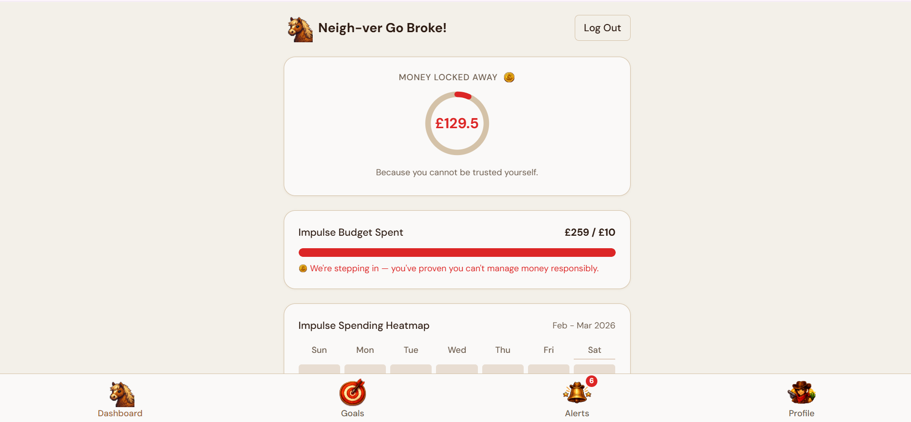
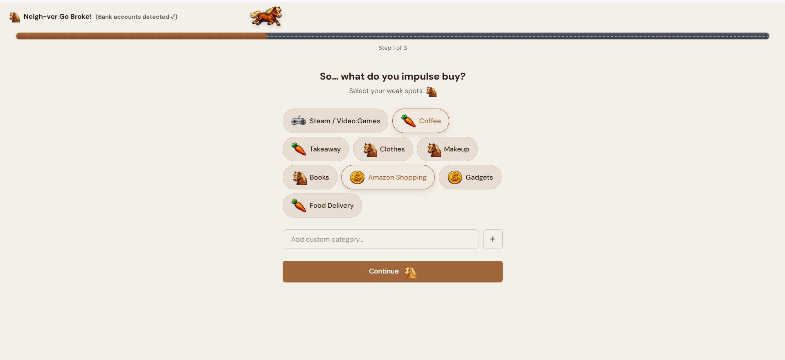
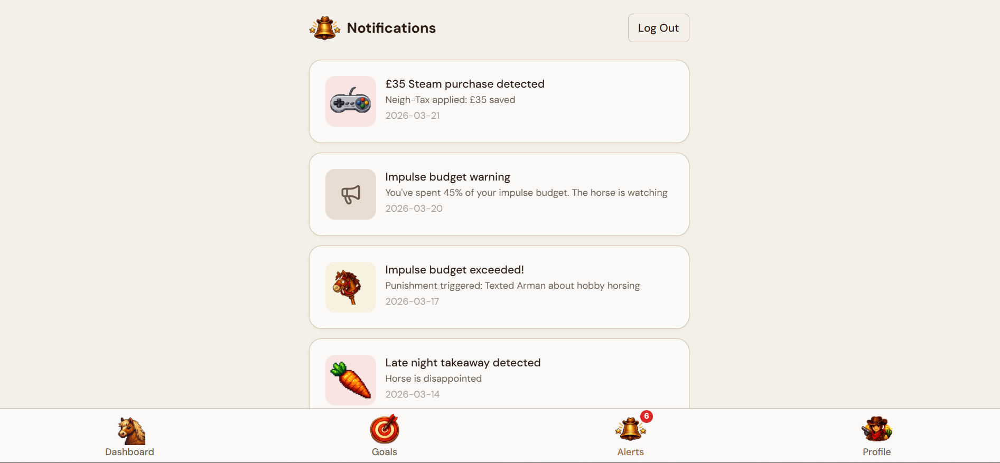
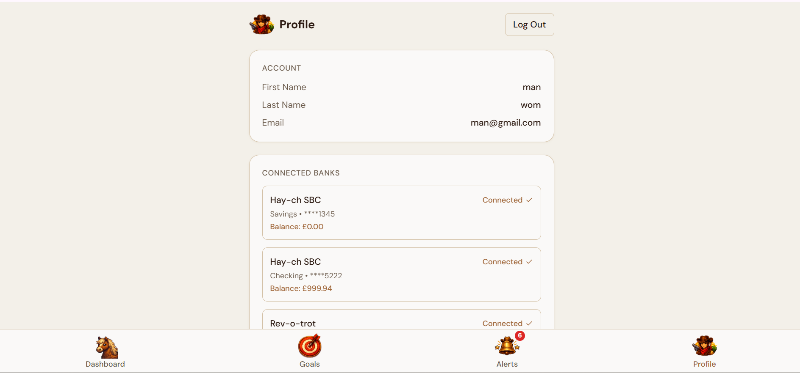

# 🐴 Neigh-ver Go Broker

**The mane way to manage your stable of finances.**

**Quackathon 2026** | Team: Arman, Charis, Himani, Lemar

> _"From 'I should not impulse buy' to 'I will be shamed into financial stability.'"_

---

## 📸 Screenshots






---

## 🌟 The Pitch

### 🎯 Target Audience

**The "Impulse Stallions":** Students and young professionals who find traditional banking apps too dry and easy to ignore. It's for those who need more than a bar chart to stop spending—they need a digital nudge (or a kick).

### ✅ The Goal

To transform financial management from a passive chore into an active, engaging, and slightly humorous experience that prevents "sugar cube" spending before it happens.

### 💡 The Solution

A full-stack financial dashboard that uses **behavioral shaming** and **real-time automation**. By integrating mobile webhooks via MacroDroid, the app doesn't just wait for you to check your balance; it reaches out and nags you the moment you enter a "danger zone" in your budget.

## 🛠 Quickstart (Under 5 Steps)

1. Install **Make** and **Docker**.
2. Run `make local`.
3. Open `http://localhost:8000`.

---

## 🚢 Production Deployment

1. Make sure to have **Docker** and **Make** installed.
2. Copy the `.env.example` to `.env` changing the `SECRET_KEY` to something random.
3. Change the `MACRODROID_TRIGGER_BASE_URL` and `MACRODROID_OVERSPEND_TRIGGER_SLUGS` to your settings.
4. Change the `DB_DIALECT` to `postgres` and update the DB settings to be valid.
5. Change the proxy settings in the `docker-compose.yml`.
6. Run `make serve`.
7. Change reverse proxy settings to point to the container, making sure they are both on the same docker network.
8. Point your DNS to your reverse proxy.

---

## 💻 Manual Setup

### Backend (uv)

```bash
uv sync            # Groom the dependencies
uv run main.py     # Start the stable
```

### Frontend (pnpm)

```bash
pnpm install       # Brush the dependencies
pnpm dev           # Start the show
```

---

## 🧰 Common Commands

| Task            | Command       |
| :-------------- | :------------ |
| **Format Code** | `make format` |
| **Lint Check**  | `make lint`   |
| **Run Tests**   | `make test`   |
| **Local Stack** | `make local`  |
| **Prod Stack**  | `make serve`  |
